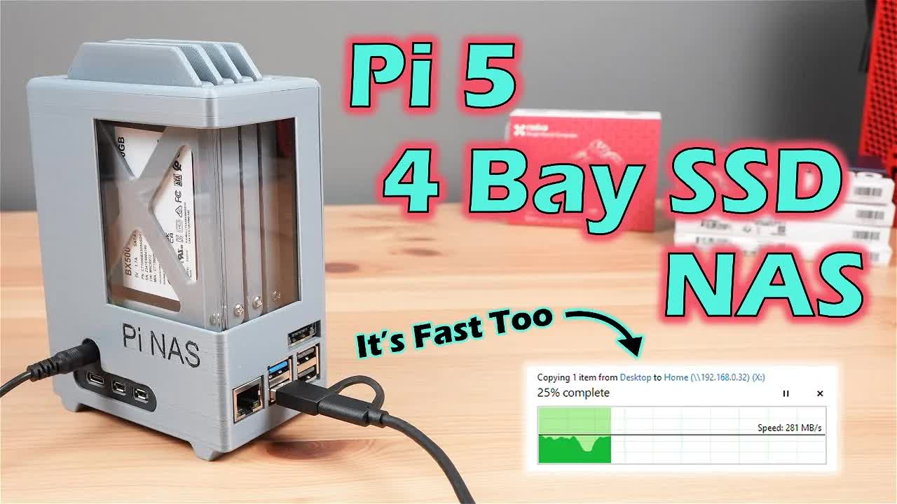

# I-Built-A-4-Bay-NAS-Using-A-Raspberry-Pi-5

<picture></picture>

 

---

## Video Information

| Property | Value |
|----------|-------|
| **Video Name** | `I-Built-A-4-Bay-NAS-Using-A-Raspberry-Pi-5` |
| **Original Link** | [YouTube Video](https://www.youtube.com/watch?v=vIEjdjS7uVg) |
| **Total Size** | **2 parts** - **52.42 MB** |
| **Quality** | **720** |
| **Status** | **Complete (100%)** |
| **Password Protected** | **NO** |

---

## Download Links

> ⬇️ Download **all parts**, then open `I-Built-A-4-Bay-NAS-Using-A-Raspberry-Pi-5.zip`

| # | File | Link |
|---|------|------|
| 1 | `I-Built-A-4-Bay-NAS-Using-A-Raspberry-Pi-5.z01` | [Download](https://raw.githubusercontent.com/tester25725/Downloader-video01/main/videos/I-Built-A-4-Bay-NAS-Using-A-Raspberry-Pi-5/I-Built-A-4-Bay-NAS-Using-A-Raspberry-Pi-5.z01) |
| 2 | `I-Built-A-4-Bay-NAS-Using-A-Raspberry-Pi-5.zip` | [Download](https://raw.githubusercontent.com/tester25725/Downloader-video01/main/videos/I-Built-A-4-Bay-NAS-Using-A-Raspberry-Pi-5/I-Built-A-4-Bay-NAS-Using-A-Raspberry-Pi-5.zip) |

---

*Created by [avasam.ir](https://avasam.ir)*
