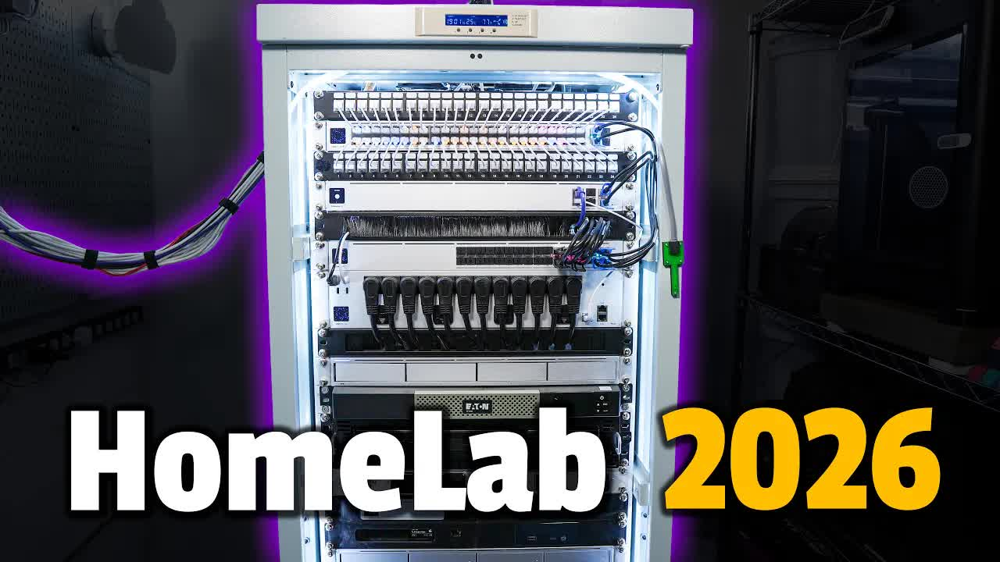

# My-2026-Homelab-Tour-(Rack-+-Servers-+-Network-+-Storage)

<picture></picture>

 

---

## Video Information

| Property | Value |
|----------|-------|
| **Video Name** | `My-2026-Homelab-Tour-(Rack-+-Servers-+-Network-+-Storage)` |
| **Original Link** | [YouTube Video](https://www.youtube.com/watch?v=-KJ0jmUgAmw) |
| **Total Size** | **4 parts** - **145.40 MB** |
| **Quality** | **720** |
| **Status** | **Complete (100%)** |
| **Password Protected** | **NO** |

---

## Download Links

> ⬇️ Download **all parts**, then open `My-2026-Homelab-Tour-(Rack-+-Servers-+-Network-+-Storage).zip`

| # | File | Link |
|---|------|------|
| 1 | `My-2026-Homelab-Tour-(Rack-+-Servers-+-Network-+-Storage).z01` | [Download](https://raw.githubusercontent.com/tester25725/Downloader-video01/main/videos/My-2026-Homelab-Tour-%28Rack-%2B-Servers-%2B-Network-%2B-Storage%29/My-2026-Homelab-Tour-%28Rack-%2B-Servers-%2B-Network-%2B-Storage%29.z01) |
| 2 | `My-2026-Homelab-Tour-(Rack-+-Servers-+-Network-+-Storage).z02` | [Download](https://raw.githubusercontent.com/tester25725/Downloader-video01/main/videos/My-2026-Homelab-Tour-%28Rack-%2B-Servers-%2B-Network-%2B-Storage%29/My-2026-Homelab-Tour-%28Rack-%2B-Servers-%2B-Network-%2B-Storage%29.z02) |
| 3 | `My-2026-Homelab-Tour-(Rack-+-Servers-+-Network-+-Storage).z03` | [Download](https://raw.githubusercontent.com/tester25725/Downloader-video01/main/videos/My-2026-Homelab-Tour-%28Rack-%2B-Servers-%2B-Network-%2B-Storage%29/My-2026-Homelab-Tour-%28Rack-%2B-Servers-%2B-Network-%2B-Storage%29.z03) |
| 4 | `My-2026-Homelab-Tour-(Rack-+-Servers-+-Network-+-Storage).zip` | [Download](https://raw.githubusercontent.com/tester25725/Downloader-video01/main/videos/My-2026-Homelab-Tour-%28Rack-%2B-Servers-%2B-Network-%2B-Storage%29/My-2026-Homelab-Tour-%28Rack-%2B-Servers-%2B-Network-%2B-Storage%29.zip) |

---

*Created by [avasam.ir](https://avasam.ir)*
