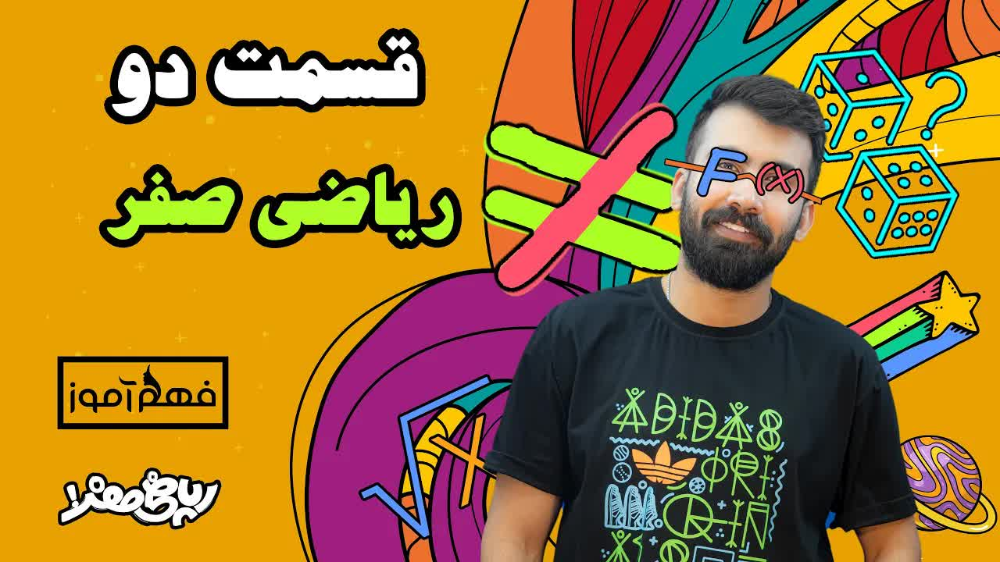

# ریاضی-صفر-قسمت2-⧸-متفاوت-ترین-آموزش-ریاضی-پایه-(ریاضی-صفر-محمد-پیمانی)

<picture></picture>

 

---

## Video Information

| Property | Value |
|----------|-------|
| **Video Name** | `ریاضی-صفر-قسمت2-⧸-متفاوت-ترین-آموزش-ریاضی-پایه-(ریاضی-صفر-محمد-پیمانی)` |
| **Original Link** | [YouTube Video](https://www.youtube.com/watch?v=KyOQyZ9h0dc&list=PLtTgUb5hvmv4c1MZE7GpjUTRASpQsjta_&index=2&pp=iAQB) |
| **Total Size** | **16 parts** - **696.95 MB** |
| **Quality** | **720** |
| **Status** | **Complete (100%)** |
| **Password Protected** | **NO** |

---

## Download Links

> ⬇️ Download **all parts**, then open `ریاضی-صفر-قسمت2-⧸-متفاوت-ترین-آموزش-ریاضی-پایه-(ریاضی-صفر-محمد-پیمانی).zip`

| # | File | Link |
|---|------|------|
| 1 | `ریاضی-صفر-قسمت2-⧸-متفاوت-ترین-آموزش-ریاضی-پایه-(ریاضی-صفر-محمد-پیمانی).z01` | [Download](https://raw.githubusercontent.com/tester25725/Downloader-video01/main/videos/%D8%B1%DB%8C%D8%A7%D8%B6%DB%8C-%D8%B5%D9%81%D8%B1-%D9%82%D8%B3%D9%85%D8%AA2-%E2%A7%B8-%D9%85%D8%AA%D9%81%D8%A7%D9%88%D8%AA-%D8%AA%D8%B1%DB%8C%D9%86-%D8%A2%D9%85%D9%88%D8%B2%D8%B4-%D8%B1%DB%8C%D8%A7%D8%B6%DB%8C-%D9%BE%D8%A7%DB%8C%D9%87-%28%D8%B1%DB%8C%D8%A7%D8%B6%DB%8C-%D8%B5%D9%81%D8%B1-%D9%85%D8%AD%D9%85%D8%AF-%D9%BE%DB%8C%D9%85%D8%A7%D9%86%DB%8C%29/%D8%B1%DB%8C%D8%A7%D8%B6%DB%8C-%D8%B5%D9%81%D8%B1-%D9%82%D8%B3%D9%85%D8%AA2-%E2%A7%B8-%D9%85%D8%AA%D9%81%D8%A7%D9%88%D8%AA-%D8%AA%D8%B1%DB%8C%D9%86-%D8%A2%D9%85%D9%88%D8%B2%D8%B4-%D8%B1%DB%8C%D8%A7%D8%B6%DB%8C-%D9%BE%D8%A7%DB%8C%D9%87-%28%D8%B1%DB%8C%D8%A7%D8%B6%DB%8C-%D8%B5%D9%81%D8%B1-%D9%85%D8%AD%D9%85%D8%AF-%D9%BE%DB%8C%D9%85%D8%A7%D9%86%DB%8C%29.z01) |
| 2 | `ریاضی-صفر-قسمت2-⧸-متفاوت-ترین-آموزش-ریاضی-پایه-(ریاضی-صفر-محمد-پیمانی).z02` | [Download](https://raw.githubusercontent.com/tester25725/Downloader-video01/main/videos/%D8%B1%DB%8C%D8%A7%D8%B6%DB%8C-%D8%B5%D9%81%D8%B1-%D9%82%D8%B3%D9%85%D8%AA2-%E2%A7%B8-%D9%85%D8%AA%D9%81%D8%A7%D9%88%D8%AA-%D8%AA%D8%B1%DB%8C%D9%86-%D8%A2%D9%85%D9%88%D8%B2%D8%B4-%D8%B1%DB%8C%D8%A7%D8%B6%DB%8C-%D9%BE%D8%A7%DB%8C%D9%87-%28%D8%B1%DB%8C%D8%A7%D8%B6%DB%8C-%D8%B5%D9%81%D8%B1-%D9%85%D8%AD%D9%85%D8%AF-%D9%BE%DB%8C%D9%85%D8%A7%D9%86%DB%8C%29/%D8%B1%DB%8C%D8%A7%D8%B6%DB%8C-%D8%B5%D9%81%D8%B1-%D9%82%D8%B3%D9%85%D8%AA2-%E2%A7%B8-%D9%85%D8%AA%D9%81%D8%A7%D9%88%D8%AA-%D8%AA%D8%B1%DB%8C%D9%86-%D8%A2%D9%85%D9%88%D8%B2%D8%B4-%D8%B1%DB%8C%D8%A7%D8%B6%DB%8C-%D9%BE%D8%A7%DB%8C%D9%87-%28%D8%B1%DB%8C%D8%A7%D8%B6%DB%8C-%D8%B5%D9%81%D8%B1-%D9%85%D8%AD%D9%85%D8%AF-%D9%BE%DB%8C%D9%85%D8%A7%D9%86%DB%8C%29.z02) |
| 3 | `ریاضی-صفر-قسمت2-⧸-متفاوت-ترین-آموزش-ریاضی-پایه-(ریاضی-صفر-محمد-پیمانی).z03` | [Download](https://raw.githubusercontent.com/tester25725/Downloader-video01/main/videos/%D8%B1%DB%8C%D8%A7%D8%B6%DB%8C-%D8%B5%D9%81%D8%B1-%D9%82%D8%B3%D9%85%D8%AA2-%E2%A7%B8-%D9%85%D8%AA%D9%81%D8%A7%D9%88%D8%AA-%D8%AA%D8%B1%DB%8C%D9%86-%D8%A2%D9%85%D9%88%D8%B2%D8%B4-%D8%B1%DB%8C%D8%A7%D8%B6%DB%8C-%D9%BE%D8%A7%DB%8C%D9%87-%28%D8%B1%DB%8C%D8%A7%D8%B6%DB%8C-%D8%B5%D9%81%D8%B1-%D9%85%D8%AD%D9%85%D8%AF-%D9%BE%DB%8C%D9%85%D8%A7%D9%86%DB%8C%29/%D8%B1%DB%8C%D8%A7%D8%B6%DB%8C-%D8%B5%D9%81%D8%B1-%D9%82%D8%B3%D9%85%D8%AA2-%E2%A7%B8-%D9%85%D8%AA%D9%81%D8%A7%D9%88%D8%AA-%D8%AA%D8%B1%DB%8C%D9%86-%D8%A2%D9%85%D9%88%D8%B2%D8%B4-%D8%B1%DB%8C%D8%A7%D8%B6%DB%8C-%D9%BE%D8%A7%DB%8C%D9%87-%28%D8%B1%DB%8C%D8%A7%D8%B6%DB%8C-%D8%B5%D9%81%D8%B1-%D9%85%D8%AD%D9%85%D8%AF-%D9%BE%DB%8C%D9%85%D8%A7%D9%86%DB%8C%29.z03) |
| 4 | `ریاضی-صفر-قسمت2-⧸-متفاوت-ترین-آموزش-ریاضی-پایه-(ریاضی-صفر-محمد-پیمانی).z04` | [Download](https://raw.githubusercontent.com/tester25725/Downloader-video01/main/videos/%D8%B1%DB%8C%D8%A7%D8%B6%DB%8C-%D8%B5%D9%81%D8%B1-%D9%82%D8%B3%D9%85%D8%AA2-%E2%A7%B8-%D9%85%D8%AA%D9%81%D8%A7%D9%88%D8%AA-%D8%AA%D8%B1%DB%8C%D9%86-%D8%A2%D9%85%D9%88%D8%B2%D8%B4-%D8%B1%DB%8C%D8%A7%D8%B6%DB%8C-%D9%BE%D8%A7%DB%8C%D9%87-%28%D8%B1%DB%8C%D8%A7%D8%B6%DB%8C-%D8%B5%D9%81%D8%B1-%D9%85%D8%AD%D9%85%D8%AF-%D9%BE%DB%8C%D9%85%D8%A7%D9%86%DB%8C%29/%D8%B1%DB%8C%D8%A7%D8%B6%DB%8C-%D8%B5%D9%81%D8%B1-%D9%82%D8%B3%D9%85%D8%AA2-%E2%A7%B8-%D9%85%D8%AA%D9%81%D8%A7%D9%88%D8%AA-%D8%AA%D8%B1%DB%8C%D9%86-%D8%A2%D9%85%D9%88%D8%B2%D8%B4-%D8%B1%DB%8C%D8%A7%D8%B6%DB%8C-%D9%BE%D8%A7%DB%8C%D9%87-%28%D8%B1%DB%8C%D8%A7%D8%B6%DB%8C-%D8%B5%D9%81%D8%B1-%D9%85%D8%AD%D9%85%D8%AF-%D9%BE%DB%8C%D9%85%D8%A7%D9%86%DB%8C%29.z04) |
| 5 | `ریاضی-صفر-قسمت2-⧸-متفاوت-ترین-آموزش-ریاضی-پایه-(ریاضی-صفر-محمد-پیمانی).z05` | [Download](https://raw.githubusercontent.com/tester25725/Downloader-video01/main/videos/%D8%B1%DB%8C%D8%A7%D8%B6%DB%8C-%D8%B5%D9%81%D8%B1-%D9%82%D8%B3%D9%85%D8%AA2-%E2%A7%B8-%D9%85%D8%AA%D9%81%D8%A7%D9%88%D8%AA-%D8%AA%D8%B1%DB%8C%D9%86-%D8%A2%D9%85%D9%88%D8%B2%D8%B4-%D8%B1%DB%8C%D8%A7%D8%B6%DB%8C-%D9%BE%D8%A7%DB%8C%D9%87-%28%D8%B1%DB%8C%D8%A7%D8%B6%DB%8C-%D8%B5%D9%81%D8%B1-%D9%85%D8%AD%D9%85%D8%AF-%D9%BE%DB%8C%D9%85%D8%A7%D9%86%DB%8C%29/%D8%B1%DB%8C%D8%A7%D8%B6%DB%8C-%D8%B5%D9%81%D8%B1-%D9%82%D8%B3%D9%85%D8%AA2-%E2%A7%B8-%D9%85%D8%AA%D9%81%D8%A7%D9%88%D8%AA-%D8%AA%D8%B1%DB%8C%D9%86-%D8%A2%D9%85%D9%88%D8%B2%D8%B4-%D8%B1%DB%8C%D8%A7%D8%B6%DB%8C-%D9%BE%D8%A7%DB%8C%D9%87-%28%D8%B1%DB%8C%D8%A7%D8%B6%DB%8C-%D8%B5%D9%81%D8%B1-%D9%85%D8%AD%D9%85%D8%AF-%D9%BE%DB%8C%D9%85%D8%A7%D9%86%DB%8C%29.z05) |
| 6 | `ریاضی-صفر-قسمت2-⧸-متفاوت-ترین-آموزش-ریاضی-پایه-(ریاضی-صفر-محمد-پیمانی).z06` | [Download](https://raw.githubusercontent.com/tester25725/Downloader-video01/main/videos/%D8%B1%DB%8C%D8%A7%D8%B6%DB%8C-%D8%B5%D9%81%D8%B1-%D9%82%D8%B3%D9%85%D8%AA2-%E2%A7%B8-%D9%85%D8%AA%D9%81%D8%A7%D9%88%D8%AA-%D8%AA%D8%B1%DB%8C%D9%86-%D8%A2%D9%85%D9%88%D8%B2%D8%B4-%D8%B1%DB%8C%D8%A7%D8%B6%DB%8C-%D9%BE%D8%A7%DB%8C%D9%87-%28%D8%B1%DB%8C%D8%A7%D8%B6%DB%8C-%D8%B5%D9%81%D8%B1-%D9%85%D8%AD%D9%85%D8%AF-%D9%BE%DB%8C%D9%85%D8%A7%D9%86%DB%8C%29/%D8%B1%DB%8C%D8%A7%D8%B6%DB%8C-%D8%B5%D9%81%D8%B1-%D9%82%D8%B3%D9%85%D8%AA2-%E2%A7%B8-%D9%85%D8%AA%D9%81%D8%A7%D9%88%D8%AA-%D8%AA%D8%B1%DB%8C%D9%86-%D8%A2%D9%85%D9%88%D8%B2%D8%B4-%D8%B1%DB%8C%D8%A7%D8%B6%DB%8C-%D9%BE%D8%A7%DB%8C%D9%87-%28%D8%B1%DB%8C%D8%A7%D8%B6%DB%8C-%D8%B5%D9%81%D8%B1-%D9%85%D8%AD%D9%85%D8%AF-%D9%BE%DB%8C%D9%85%D8%A7%D9%86%DB%8C%29.z06) |
| 7 | `ریاضی-صفر-قسمت2-⧸-متفاوت-ترین-آموزش-ریاضی-پایه-(ریاضی-صفر-محمد-پیمانی).z07` | [Download](https://raw.githubusercontent.com/tester25725/Downloader-video01/main/videos/%D8%B1%DB%8C%D8%A7%D8%B6%DB%8C-%D8%B5%D9%81%D8%B1-%D9%82%D8%B3%D9%85%D8%AA2-%E2%A7%B8-%D9%85%D8%AA%D9%81%D8%A7%D9%88%D8%AA-%D8%AA%D8%B1%DB%8C%D9%86-%D8%A2%D9%85%D9%88%D8%B2%D8%B4-%D8%B1%DB%8C%D8%A7%D8%B6%DB%8C-%D9%BE%D8%A7%DB%8C%D9%87-%28%D8%B1%DB%8C%D8%A7%D8%B6%DB%8C-%D8%B5%D9%81%D8%B1-%D9%85%D8%AD%D9%85%D8%AF-%D9%BE%DB%8C%D9%85%D8%A7%D9%86%DB%8C%29/%D8%B1%DB%8C%D8%A7%D8%B6%DB%8C-%D8%B5%D9%81%D8%B1-%D9%82%D8%B3%D9%85%D8%AA2-%E2%A7%B8-%D9%85%D8%AA%D9%81%D8%A7%D9%88%D8%AA-%D8%AA%D8%B1%DB%8C%D9%86-%D8%A2%D9%85%D9%88%D8%B2%D8%B4-%D8%B1%DB%8C%D8%A7%D8%B6%DB%8C-%D9%BE%D8%A7%DB%8C%D9%87-%28%D8%B1%DB%8C%D8%A7%D8%B6%DB%8C-%D8%B5%D9%81%D8%B1-%D9%85%D8%AD%D9%85%D8%AF-%D9%BE%DB%8C%D9%85%D8%A7%D9%86%DB%8C%29.z07) |
| 8 | `ریاضی-صفر-قسمت2-⧸-متفاوت-ترین-آموزش-ریاضی-پایه-(ریاضی-صفر-محمد-پیمانی).z08` | [Download](https://raw.githubusercontent.com/tester25725/Downloader-video01/main/videos/%D8%B1%DB%8C%D8%A7%D8%B6%DB%8C-%D8%B5%D9%81%D8%B1-%D9%82%D8%B3%D9%85%D8%AA2-%E2%A7%B8-%D9%85%D8%AA%D9%81%D8%A7%D9%88%D8%AA-%D8%AA%D8%B1%DB%8C%D9%86-%D8%A2%D9%85%D9%88%D8%B2%D8%B4-%D8%B1%DB%8C%D8%A7%D8%B6%DB%8C-%D9%BE%D8%A7%DB%8C%D9%87-%28%D8%B1%DB%8C%D8%A7%D8%B6%DB%8C-%D8%B5%D9%81%D8%B1-%D9%85%D8%AD%D9%85%D8%AF-%D9%BE%DB%8C%D9%85%D8%A7%D9%86%DB%8C%29/%D8%B1%DB%8C%D8%A7%D8%B6%DB%8C-%D8%B5%D9%81%D8%B1-%D9%82%D8%B3%D9%85%D8%AA2-%E2%A7%B8-%D9%85%D8%AA%D9%81%D8%A7%D9%88%D8%AA-%D8%AA%D8%B1%DB%8C%D9%86-%D8%A2%D9%85%D9%88%D8%B2%D8%B4-%D8%B1%DB%8C%D8%A7%D8%B6%DB%8C-%D9%BE%D8%A7%DB%8C%D9%87-%28%D8%B1%DB%8C%D8%A7%D8%B6%DB%8C-%D8%B5%D9%81%D8%B1-%D9%85%D8%AD%D9%85%D8%AF-%D9%BE%DB%8C%D9%85%D8%A7%D9%86%DB%8C%29.z08) |
| 9 | `ریاضی-صفر-قسمت2-⧸-متفاوت-ترین-آموزش-ریاضی-پایه-(ریاضی-صفر-محمد-پیمانی).z09` | [Download](https://raw.githubusercontent.com/tester25725/Downloader-video01/main/videos/%D8%B1%DB%8C%D8%A7%D8%B6%DB%8C-%D8%B5%D9%81%D8%B1-%D9%82%D8%B3%D9%85%D8%AA2-%E2%A7%B8-%D9%85%D8%AA%D9%81%D8%A7%D9%88%D8%AA-%D8%AA%D8%B1%DB%8C%D9%86-%D8%A2%D9%85%D9%88%D8%B2%D8%B4-%D8%B1%DB%8C%D8%A7%D8%B6%DB%8C-%D9%BE%D8%A7%DB%8C%D9%87-%28%D8%B1%DB%8C%D8%A7%D8%B6%DB%8C-%D8%B5%D9%81%D8%B1-%D9%85%D8%AD%D9%85%D8%AF-%D9%BE%DB%8C%D9%85%D8%A7%D9%86%DB%8C%29/%D8%B1%DB%8C%D8%A7%D8%B6%DB%8C-%D8%B5%D9%81%D8%B1-%D9%82%D8%B3%D9%85%D8%AA2-%E2%A7%B8-%D9%85%D8%AA%D9%81%D8%A7%D9%88%D8%AA-%D8%AA%D8%B1%DB%8C%D9%86-%D8%A2%D9%85%D9%88%D8%B2%D8%B4-%D8%B1%DB%8C%D8%A7%D8%B6%DB%8C-%D9%BE%D8%A7%DB%8C%D9%87-%28%D8%B1%DB%8C%D8%A7%D8%B6%DB%8C-%D8%B5%D9%81%D8%B1-%D9%85%D8%AD%D9%85%D8%AF-%D9%BE%DB%8C%D9%85%D8%A7%D9%86%DB%8C%29.z09) |
| 10 | `ریاضی-صفر-قسمت2-⧸-متفاوت-ترین-آموزش-ریاضی-پایه-(ریاضی-صفر-محمد-پیمانی).z10` | [Download](https://raw.githubusercontent.com/tester25725/Downloader-video01/main/videos/%D8%B1%DB%8C%D8%A7%D8%B6%DB%8C-%D8%B5%D9%81%D8%B1-%D9%82%D8%B3%D9%85%D8%AA2-%E2%A7%B8-%D9%85%D8%AA%D9%81%D8%A7%D9%88%D8%AA-%D8%AA%D8%B1%DB%8C%D9%86-%D8%A2%D9%85%D9%88%D8%B2%D8%B4-%D8%B1%DB%8C%D8%A7%D8%B6%DB%8C-%D9%BE%D8%A7%DB%8C%D9%87-%28%D8%B1%DB%8C%D8%A7%D8%B6%DB%8C-%D8%B5%D9%81%D8%B1-%D9%85%D8%AD%D9%85%D8%AF-%D9%BE%DB%8C%D9%85%D8%A7%D9%86%DB%8C%29/%D8%B1%DB%8C%D8%A7%D8%B6%DB%8C-%D8%B5%D9%81%D8%B1-%D9%82%D8%B3%D9%85%D8%AA2-%E2%A7%B8-%D9%85%D8%AA%D9%81%D8%A7%D9%88%D8%AA-%D8%AA%D8%B1%DB%8C%D9%86-%D8%A2%D9%85%D9%88%D8%B2%D8%B4-%D8%B1%DB%8C%D8%A7%D8%B6%DB%8C-%D9%BE%D8%A7%DB%8C%D9%87-%28%D8%B1%DB%8C%D8%A7%D8%B6%DB%8C-%D8%B5%D9%81%D8%B1-%D9%85%D8%AD%D9%85%D8%AF-%D9%BE%DB%8C%D9%85%D8%A7%D9%86%DB%8C%29.z10) |
| 11 | `ریاضی-صفر-قسمت2-⧸-متفاوت-ترین-آموزش-ریاضی-پایه-(ریاضی-صفر-محمد-پیمانی).z11` | [Download](https://raw.githubusercontent.com/tester25725/Downloader-video01/main/videos/%D8%B1%DB%8C%D8%A7%D8%B6%DB%8C-%D8%B5%D9%81%D8%B1-%D9%82%D8%B3%D9%85%D8%AA2-%E2%A7%B8-%D9%85%D8%AA%D9%81%D8%A7%D9%88%D8%AA-%D8%AA%D8%B1%DB%8C%D9%86-%D8%A2%D9%85%D9%88%D8%B2%D8%B4-%D8%B1%DB%8C%D8%A7%D8%B6%DB%8C-%D9%BE%D8%A7%DB%8C%D9%87-%28%D8%B1%DB%8C%D8%A7%D8%B6%DB%8C-%D8%B5%D9%81%D8%B1-%D9%85%D8%AD%D9%85%D8%AF-%D9%BE%DB%8C%D9%85%D8%A7%D9%86%DB%8C%29/%D8%B1%DB%8C%D8%A7%D8%B6%DB%8C-%D8%B5%D9%81%D8%B1-%D9%82%D8%B3%D9%85%D8%AA2-%E2%A7%B8-%D9%85%D8%AA%D9%81%D8%A7%D9%88%D8%AA-%D8%AA%D8%B1%DB%8C%D9%86-%D8%A2%D9%85%D9%88%D8%B2%D8%B4-%D8%B1%DB%8C%D8%A7%D8%B6%DB%8C-%D9%BE%D8%A7%DB%8C%D9%87-%28%D8%B1%DB%8C%D8%A7%D8%B6%DB%8C-%D8%B5%D9%81%D8%B1-%D9%85%D8%AD%D9%85%D8%AF-%D9%BE%DB%8C%D9%85%D8%A7%D9%86%DB%8C%29.z11) |
| 12 | `ریاضی-صفر-قسمت2-⧸-متفاوت-ترین-آموزش-ریاضی-پایه-(ریاضی-صفر-محمد-پیمانی).z12` | [Download](https://raw.githubusercontent.com/tester25725/Downloader-video01/main/videos/%D8%B1%DB%8C%D8%A7%D8%B6%DB%8C-%D8%B5%D9%81%D8%B1-%D9%82%D8%B3%D9%85%D8%AA2-%E2%A7%B8-%D9%85%D8%AA%D9%81%D8%A7%D9%88%D8%AA-%D8%AA%D8%B1%DB%8C%D9%86-%D8%A2%D9%85%D9%88%D8%B2%D8%B4-%D8%B1%DB%8C%D8%A7%D8%B6%DB%8C-%D9%BE%D8%A7%DB%8C%D9%87-%28%D8%B1%DB%8C%D8%A7%D8%B6%DB%8C-%D8%B5%D9%81%D8%B1-%D9%85%D8%AD%D9%85%D8%AF-%D9%BE%DB%8C%D9%85%D8%A7%D9%86%DB%8C%29/%D8%B1%DB%8C%D8%A7%D8%B6%DB%8C-%D8%B5%D9%81%D8%B1-%D9%82%D8%B3%D9%85%D8%AA2-%E2%A7%B8-%D9%85%D8%AA%D9%81%D8%A7%D9%88%D8%AA-%D8%AA%D8%B1%DB%8C%D9%86-%D8%A2%D9%85%D9%88%D8%B2%D8%B4-%D8%B1%DB%8C%D8%A7%D8%B6%DB%8C-%D9%BE%D8%A7%DB%8C%D9%87-%28%D8%B1%DB%8C%D8%A7%D8%B6%DB%8C-%D8%B5%D9%81%D8%B1-%D9%85%D8%AD%D9%85%D8%AF-%D9%BE%DB%8C%D9%85%D8%A7%D9%86%DB%8C%29.z12) |
| 13 | `ریاضی-صفر-قسمت2-⧸-متفاوت-ترین-آموزش-ریاضی-پایه-(ریاضی-صفر-محمد-پیمانی).z13` | [Download](https://raw.githubusercontent.com/tester25725/Downloader-video01/main/videos/%D8%B1%DB%8C%D8%A7%D8%B6%DB%8C-%D8%B5%D9%81%D8%B1-%D9%82%D8%B3%D9%85%D8%AA2-%E2%A7%B8-%D9%85%D8%AA%D9%81%D8%A7%D9%88%D8%AA-%D8%AA%D8%B1%DB%8C%D9%86-%D8%A2%D9%85%D9%88%D8%B2%D8%B4-%D8%B1%DB%8C%D8%A7%D8%B6%DB%8C-%D9%BE%D8%A7%DB%8C%D9%87-%28%D8%B1%DB%8C%D8%A7%D8%B6%DB%8C-%D8%B5%D9%81%D8%B1-%D9%85%D8%AD%D9%85%D8%AF-%D9%BE%DB%8C%D9%85%D8%A7%D9%86%DB%8C%29/%D8%B1%DB%8C%D8%A7%D8%B6%DB%8C-%D8%B5%D9%81%D8%B1-%D9%82%D8%B3%D9%85%D8%AA2-%E2%A7%B8-%D9%85%D8%AA%D9%81%D8%A7%D9%88%D8%AA-%D8%AA%D8%B1%DB%8C%D9%86-%D8%A2%D9%85%D9%88%D8%B2%D8%B4-%D8%B1%DB%8C%D8%A7%D8%B6%DB%8C-%D9%BE%D8%A7%DB%8C%D9%87-%28%D8%B1%DB%8C%D8%A7%D8%B6%DB%8C-%D8%B5%D9%81%D8%B1-%D9%85%D8%AD%D9%85%D8%AF-%D9%BE%DB%8C%D9%85%D8%A7%D9%86%DB%8C%29.z13) |
| 14 | `ریاضی-صفر-قسمت2-⧸-متفاوت-ترین-آموزش-ریاضی-پایه-(ریاضی-صفر-محمد-پیمانی).z14` | [Download](https://raw.githubusercontent.com/tester25725/Downloader-video01/main/videos/%D8%B1%DB%8C%D8%A7%D8%B6%DB%8C-%D8%B5%D9%81%D8%B1-%D9%82%D8%B3%D9%85%D8%AA2-%E2%A7%B8-%D9%85%D8%AA%D9%81%D8%A7%D9%88%D8%AA-%D8%AA%D8%B1%DB%8C%D9%86-%D8%A2%D9%85%D9%88%D8%B2%D8%B4-%D8%B1%DB%8C%D8%A7%D8%B6%DB%8C-%D9%BE%D8%A7%DB%8C%D9%87-%28%D8%B1%DB%8C%D8%A7%D8%B6%DB%8C-%D8%B5%D9%81%D8%B1-%D9%85%D8%AD%D9%85%D8%AF-%D9%BE%DB%8C%D9%85%D8%A7%D9%86%DB%8C%29/%D8%B1%DB%8C%D8%A7%D8%B6%DB%8C-%D8%B5%D9%81%D8%B1-%D9%82%D8%B3%D9%85%D8%AA2-%E2%A7%B8-%D9%85%D8%AA%D9%81%D8%A7%D9%88%D8%AA-%D8%AA%D8%B1%DB%8C%D9%86-%D8%A2%D9%85%D9%88%D8%B2%D8%B4-%D8%B1%DB%8C%D8%A7%D8%B6%DB%8C-%D9%BE%D8%A7%DB%8C%D9%87-%28%D8%B1%DB%8C%D8%A7%D8%B6%DB%8C-%D8%B5%D9%81%D8%B1-%D9%85%D8%AD%D9%85%D8%AF-%D9%BE%DB%8C%D9%85%D8%A7%D9%86%DB%8C%29.z14) |
| 15 | `ریاضی-صفر-قسمت2-⧸-متفاوت-ترین-آموزش-ریاضی-پایه-(ریاضی-صفر-محمد-پیمانی).z15` | [Download](https://raw.githubusercontent.com/tester25725/Downloader-video01/main/videos/%D8%B1%DB%8C%D8%A7%D8%B6%DB%8C-%D8%B5%D9%81%D8%B1-%D9%82%D8%B3%D9%85%D8%AA2-%E2%A7%B8-%D9%85%D8%AA%D9%81%D8%A7%D9%88%D8%AA-%D8%AA%D8%B1%DB%8C%D9%86-%D8%A2%D9%85%D9%88%D8%B2%D8%B4-%D8%B1%DB%8C%D8%A7%D8%B6%DB%8C-%D9%BE%D8%A7%DB%8C%D9%87-%28%D8%B1%DB%8C%D8%A7%D8%B6%DB%8C-%D8%B5%D9%81%D8%B1-%D9%85%D8%AD%D9%85%D8%AF-%D9%BE%DB%8C%D9%85%D8%A7%D9%86%DB%8C%29/%D8%B1%DB%8C%D8%A7%D8%B6%DB%8C-%D8%B5%D9%81%D8%B1-%D9%82%D8%B3%D9%85%D8%AA2-%E2%A7%B8-%D9%85%D8%AA%D9%81%D8%A7%D9%88%D8%AA-%D8%AA%D8%B1%DB%8C%D9%86-%D8%A2%D9%85%D9%88%D8%B2%D8%B4-%D8%B1%DB%8C%D8%A7%D8%B6%DB%8C-%D9%BE%D8%A7%DB%8C%D9%87-%28%D8%B1%DB%8C%D8%A7%D8%B6%DB%8C-%D8%B5%D9%81%D8%B1-%D9%85%D8%AD%D9%85%D8%AF-%D9%BE%DB%8C%D9%85%D8%A7%D9%86%DB%8C%29.z15) |
| 16 | `ریاضی-صفر-قسمت2-⧸-متفاوت-ترین-آموزش-ریاضی-پایه-(ریاضی-صفر-محمد-پیمانی).zip` | [Download](https://raw.githubusercontent.com/tester25725/Downloader-video01/main/videos/%D8%B1%DB%8C%D8%A7%D8%B6%DB%8C-%D8%B5%D9%81%D8%B1-%D9%82%D8%B3%D9%85%D8%AA2-%E2%A7%B8-%D9%85%D8%AA%D9%81%D8%A7%D9%88%D8%AA-%D8%AA%D8%B1%DB%8C%D9%86-%D8%A2%D9%85%D9%88%D8%B2%D8%B4-%D8%B1%DB%8C%D8%A7%D8%B6%DB%8C-%D9%BE%D8%A7%DB%8C%D9%87-%28%D8%B1%DB%8C%D8%A7%D8%B6%DB%8C-%D8%B5%D9%81%D8%B1-%D9%85%D8%AD%D9%85%D8%AF-%D9%BE%DB%8C%D9%85%D8%A7%D9%86%DB%8C%29/%D8%B1%DB%8C%D8%A7%D8%B6%DB%8C-%D8%B5%D9%81%D8%B1-%D9%82%D8%B3%D9%85%D8%AA2-%E2%A7%B8-%D9%85%D8%AA%D9%81%D8%A7%D9%88%D8%AA-%D8%AA%D8%B1%DB%8C%D9%86-%D8%A2%D9%85%D9%88%D8%B2%D8%B4-%D8%B1%DB%8C%D8%A7%D8%B6%DB%8C-%D9%BE%D8%A7%DB%8C%D9%87-%28%D8%B1%DB%8C%D8%A7%D8%B6%DB%8C-%D8%B5%D9%81%D8%B1-%D9%85%D8%AD%D9%85%D8%AF-%D9%BE%DB%8C%D9%85%D8%A7%D9%86%DB%8C%29.zip) |

---

*Created by [avasam.ir](https://avasam.ir)*
